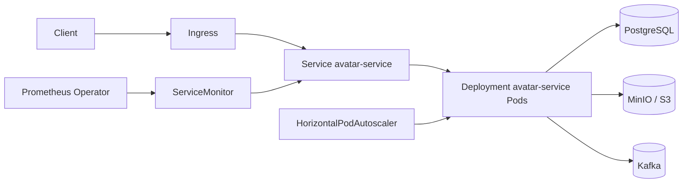

# GophProfile

Микросервис для управления аватарками пользователей.

## Стек
- Go (Chi)
- PostgreSQL
- MinIO (S3)
- Kafka
- OpenTelemetry (traces)
- Prometheus (metrics)
- Jaeger (tracing UI)
- Grafana (dashboards)
- Loki + Promtail (logs)
- Alertmanager (alerts)
- Docker / Docker Compose
- Kubernetes + Helm

## Локальный запуск (Docker Compose)

```bash
# Запустить всё окружение
docker compose up --build -d

# Проверить health
curl http://localhost:8080/health
# Проверить метрики
curl http://localhost:8080/metrics

# Загрузить аватарку
curl -X POST http://localhost:8080/api/v1/avatars \
  -H "X-User-ID: user1" \
  -F "image=@photo.jpg"

# Веб-интерфейс
http://localhost:8080/web/upload
```

Остановка окружения:
```bash
docker compose down -v
```

## Наблюдаемость

После запуска `docker compose up --build -d` доступны:
- **Prometheus**: http://localhost:9090
- **Grafana**: http://localhost:3000 (логин/пароль: `admin` / `admin`)
- **Jaeger**: http://localhost:16686
- **Alertmanager**: http://localhost:9093
- **Loki**: http://localhost:3100 (обычно используется через Grafana)

### Что уже настроено
- HTTP RED-метрики (`avatars_http_requests_total`, `avatars_http_errors_total`, `avatars_http_request_duration_seconds`)
- Бизнес-метрики (`avatars_uploads_total`, `avatars_upload_duration_seconds`, `avatars_storage_bytes`)
- Инфраструктурные метрики (`avatars_db_connections`, `avatars_queue_depth`, `avatars_kafka_messages_total`)
- Распределённый трейсинг для HTTP, PostgreSQL, MinIO, Kafka producer/consumer и worker
- Context propagation через Kafka headers (`traceparent` / `tracestate`)
- Структурированные JSON-логи на `slog` с `trace_id`/`span_id`
- Grafana dashboard: `GophProfile - Service Overview`
- Alert rules в `deploy/prometheus/alerts.yml`:
  - `HighErrorRate`
  - `HighResponseTime`

## API (OpenAPI)

Актуальная OpenAPI-спецификация: `docs/openapi.yaml`.

Ключевые endpoint'ы:
- `POST /api/v1/avatars`
- `GET /api/v1/avatars/{avatar_id}`
- `GET /api/v1/avatars/{avatar_id}/metadata`
- `DELETE /api/v1/avatars/{avatar_id}`
- `GET /api/v1/users/{user_id}/avatar`
- `GET /api/v1/users/{user_id}/avatars`
- `DELETE /api/v1/users/{user_id}/avatar`
- `GET /health`
- `GET /metrics`

## Kubernetes-деплой

### Вариант 1: прямые манифесты

Манифесты находятся в `deploy/k8s/`:
- `ConfigMap`, `Secret`
- `Deployment`, `Service`, `Ingress`
- `HorizontalPodAutoscaler`
- `ServiceMonitor`
- `NetworkPolicy`
- `ServiceAccount`, `Role`, `RoleBinding`

Применение:
```bash
kubectl apply -f deploy/k8s/
```

### Вариант 2: Helm chart

Chart: `helm/gophprofile`.

Установка (dev):
```bash
helm upgrade --install gophprofile ./helm/gophprofile -f ./helm/gophprofile/values-dev.yaml -n gophprofile --create-namespace
```

Установка (prod):
```bash
helm upgrade --install gophprofile ./helm/gophprofile -f ./helm/gophprofile/values-prod.yaml -n gophprofile --create-namespace
```

В chart есть pre-install/pre-upgrade hook job `migrator` для применения миграций БД.

## Безопасность

- Pod/Container `securityContext` с запуском от non-root пользователя
- `allowPrivilegeEscalation: false`, `readOnlyRootFilesystem: true`, `capabilities.drop: ["ALL"]`
- Отдельный `ServiceAccount` с `automountServiceAccountToken: false`
- `NetworkPolicy` для ограничения ingress/egress

## Graceful Shutdown

Сервер (`cmd/server/main.go`) и воркер (`cmd/worker/main.go`) обрабатывают `SIGINT/SIGTERM`, завершают HTTP/Kafka работу и корректно закрывают зависимости.

## Архитектура (Kubernetes)



## Тесты

```bash
go test ./internal/... -v
```
